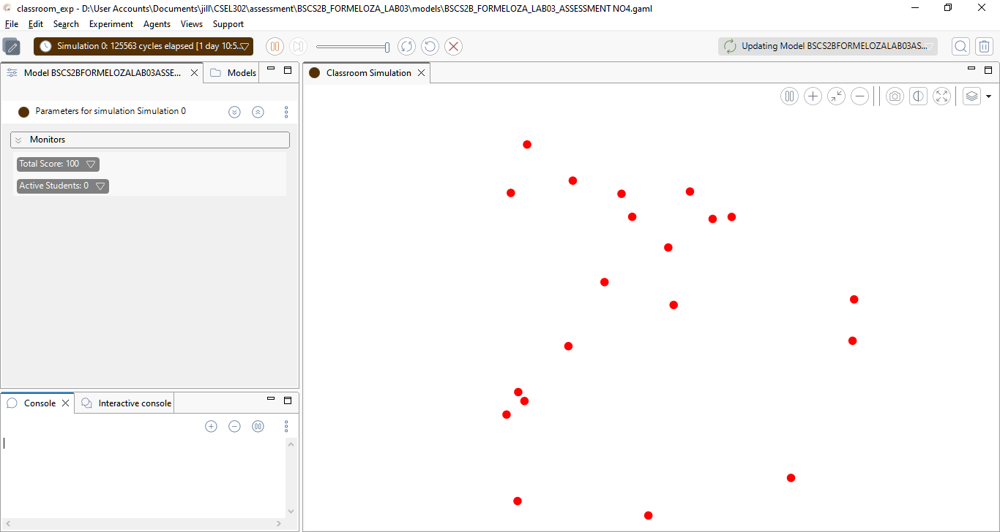
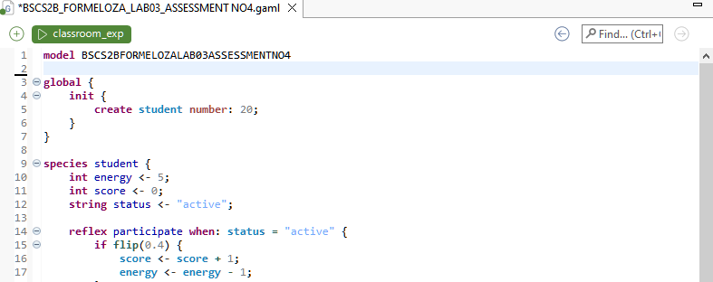
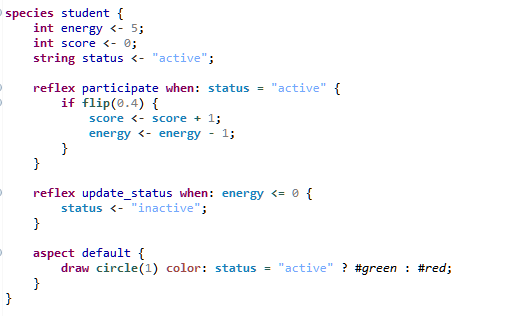
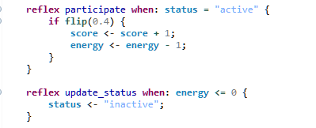
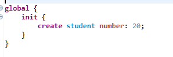
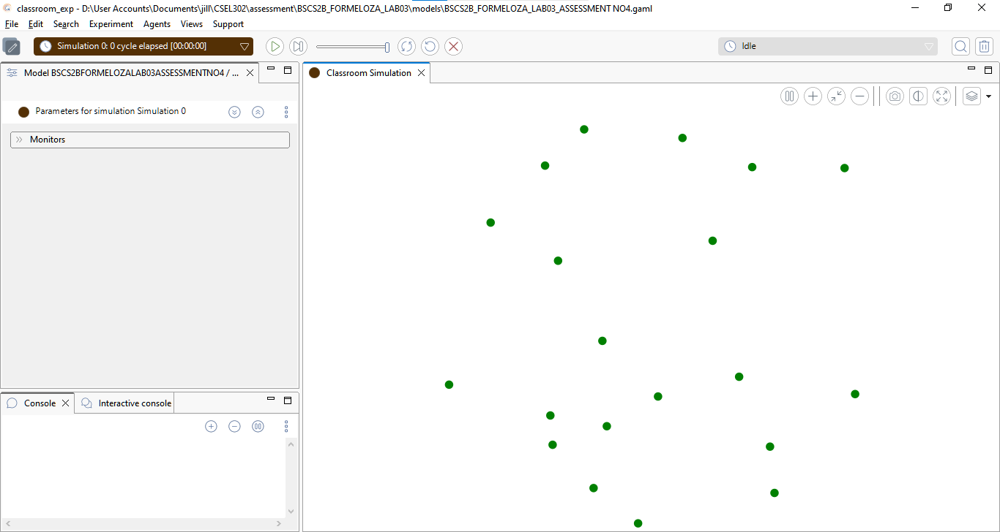
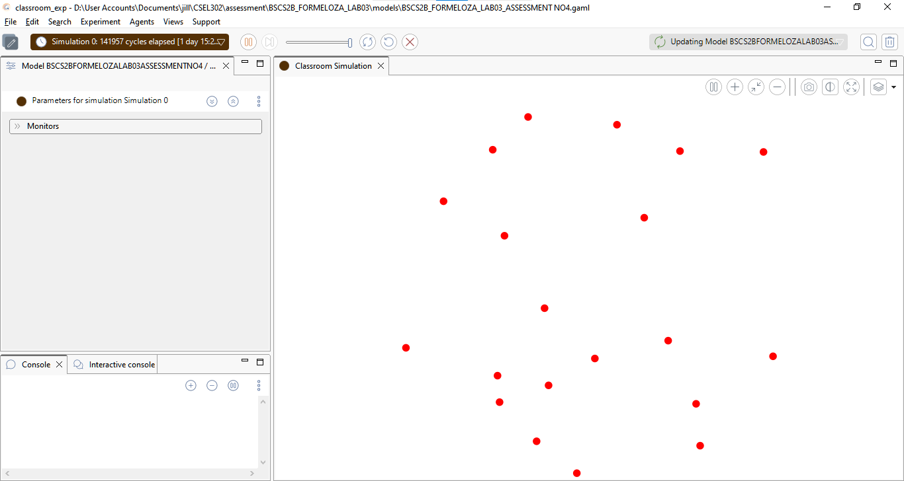

FORMELOZA, JILLIAN ROSE O.
BSCS-2B

Part 1

You will create a simple classroom participation simulation.
Each student agent has the following attributes:

Attribute	Description
energy	ability of the student to participate
score	participation score
status	active or inactive

Rules
1.Students may participate in class.
2.When participating:
oscore increases by 1
oenergy decreases by 1
3.When energy reaches 0, the student becomes inactive.

Part 2 – Step 1: Create the Model
Create a new GAMA model.

Part 3 – Step 2: Define the Student Agent
Create a student species.

Part 4 and Part 5 -  Add Behavior (Participation)
Students randomly participate in class. Add Reflex for Status Update
When energy becomes 0, change the status.

Part 6 : Create the Environment
Add the global section.

Part 7 : Run the Simulation

Part 8 – Guide Questions
1.What happens to students when energy reaches 0?
    -When a student's energy reaches 0, their status changes from "active" to "inactive". Once inactive, the participate reflex no longer triggers because it has the condition when: status = "active", so the student can no longer gain any score.

2.How does participation affect score and energy?
    -Every time a student successfully participates (40% chance per step), their score increases by 1 while their energy decreases by 1. This means score and energy have an inverse relationship the more a student participates, the higher their score but the faster their energy is consumed.
    
3.If participation probability increases to 0.8, what happens?
    -If flip(0.4) is changed to flip(0.8), students participate more frequently, causing their scores to rise faster but their energy to deplete much quicker as well. As a result, students will become inactive much sooner compared to the 0.4 version, and the overall simulation will end faster since agents run out of energy at a higher rate.

4.What pattern do you observe in the simulation?
    -At the start, all 20 students are active. Over time, students gradually become inactive as their energy reaches 0. Since flip() uses random probability, each student follows a slightly different path, some participate more, some less, leading to varying scores and different times of becoming inactive. This demonstrates emergent behavior: the same simple rules produce different outcomes for each agent across every simulation run.

SHORT EXPLANATION:
    - In this simulation, each student agent has energy and a score that change based on their classroom participation. There is a 40% chance per step that an active student will participate, which increases their score by 1 and decreases their energy by 1. Once a student's energy reaches zero, they become inactive and can no longer participate. The simulation demonstrates emergent behavior, where the same set of simple rules leads to different outcomes for each agent across every run. This shows how complex patterns can arise from basic agent behaviors in an agent-based system.